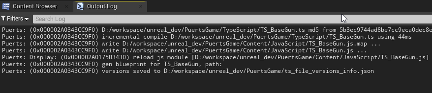

# Branches Introduction

+ `main`: the newest content of this example.
+ `rpc`: implement shooting and `RPC` logic.
+ `shooting`: implement basic shooting logic only.

# Summary

[PuerTS](https://github.com/Tencent/puerts) is a high performance script system for Unity and Unreal that founded by [chexiongsheng](https://github.com/chexiongsheng).

This repository is the personal study note referenced to author's tutorial, since there're some issues didn't mentioned in origin documents.

Official tutorial:
跟我用TypeScript做一个FPS游戏  
https://zhuanlan.zhihu.com/p/346531865

Showcase  

***

# Setup

+ Install Unreal Engine 4.
+ Install nodejs: https://nodejs.org/en/download/
+ Clone puerts from https://github.com/Tencent/puerts
+ Copy directory `puerts/unreal/Puerts/` into this project:`PuertsGame/Plugins/Puerts/`.
+ Open cmd and address to directory `PuertsGame/Plugins/Puerts/`, execute command:
    
        node enable_puerts_module.js
    
+ Bulid from visual studio, and start editor, then click plugin button `ud.d.ts`:  

+ If can't find `TS_BaseGun`, `TS_Player` and `TS_Rifle` in directory `PuertsGame/Blueprints/TypeScript/`, which were generated by `PuerTS`, in editor content browser.  
  
You need to fire hot compilcation by adding empty line in TypeScript source file.  
  
If add a blank line and save file, log would output that TypeScript source has been re-compiled:  
  
Then `PuerTS` would auto compile this TypeScript source and auto generate Unreal `.uasset` file under directory `PuertsGame/Blueprints/TypeScript/`.  
+ Set `GameMode` and `Default Pawn Class` in World Settings panel:  
  

***

# Debug in IntelliJ IDEA

+ UE4Editor -> Edit -> Project Settings -> Plugins -> Puerts Settings -> Enable `Debug Mode`, and set `Debug Port` as an unoccupied port (`8889` recommended).  

+ IntelliJ IDEA -> Run -> Edit Configurations  

+ Add New Configuration -> Attach to Node.js / Chrome  

+ Set `Port` as the same as UE4Editor settings (`8889`)  

+ Re-startup UE4Editor at first time.
+ Debug TypeScript in IntelliJ IDEA:  

+ Play game in UE4Editor.
+ Then breakpoints in IntelliJ IDEA would be hit, and you can watch variables values:  

***

# RPC

To enable RPC, add `"experimentalDecorators": true` in `PuertsGame/tsconfig.json`:

    {
        "compilerOptions": {
            "target": "esnext",
            "module": "commonjs",
            "experimentalDecorators": true,
            "jsx": "react",
            "sourceMap": true,
            "typeRoots": [
                "Plugins/Puerts/Typing",
                "./node_modules/@types"
            ],
            "outDir": "Content/JavaScript"
        },
        "include": [
            "TypeScript/**/*"
        ]
    }

Otherwise you would get warning:

    Error D:/PuertsGame/TypeScript/TS_Player.ts (101,5): Experimental support for decorators is a feature that is subject to change in a future release. Set the 'experimentalDecorators' option to remove this warning.

Open `BP_Target`.  

Check `Replicates` in Detail panels.  

Check `Replicates` in Detail panels.  
Then select `CubeMesh` of `BP_Target`, and check `Component Replicates`.  

Select property `Health` of `BP_Target`, then set Replication as `RepNotify`.  

Implement function `On Rep Health` which was generated by Blueprint.  

Remove node `Update Color` in function `Take Damage`.  

Select `Net Mode` of `Multiplayer Options` as `Play as Client`.  

Now you can run game with RPC demonstration.

# Package

## Issues 1

Project Settings -> Packaging -> Additional Non-Asset Directories To Copy -> Add directory `JavaScript`.

Otherwise, you would get error on startup:

    Puerts: Error: (0x00000228FF6B3BF0) can not find [puerts/first_run.js]
    Puerts: Error: (0x00000228FF6B3BF0) can not find [puerts/polyfill.js]
    Puerts: Error: (0x00000228FF6B3BF0) can not find [puerts/log.js]
    Puerts: Error: (0x00000228FF6B3BF0) can not find [puerts/modular.js]
    Puerts: Error: (0x00000228FF6B3BF0) can not find [puerts/uelazyload.js]
    Puerts: Error: (0x00000228FF6B3BF0) can not find [puerts/events.js]
    Puerts: Error: (0x00000228FF6B3BF0) can not find [puerts/promises.js]
    Puerts: Error: (0x00000228FF6B3BF0) can not find [puerts/argv.js]
    Puerts: Error: (0x00000228FF6B3BF0) can not find [puerts/jit_stub.js]
    Puerts: Error: (0x00000228FF6B3BF0) can not find [puerts/hot_reload.js]

## Issues 2

Don't load object in Constructor since there are some limits in Unreal.

    Constructor() 
    {
        this.PS_BulletImpact = UE.ParticleSystem.Load("/Game/BlockBreaker/ParticleSystems/PS_BulletImpact");
    }
Otherwise, you would get error on startup:

    Assertion failed: AsyncLoadingThread.RecursionNotAllowed.Increment() == 1 [File:D:/Build/++UE4/Sync/Engine/Source/Runtime/CoreUObject/Private/Serialization/AsyncLoading.cpp] [Line: 3992] 

Alteration: load object in `ReceiveBeginPlay`:

    ReceiveBeginPlay(): void
    {
        this.PS_BulletImpact = UE.ParticleSystem.Load("/Game/BlockBreaker/ParticleSystems/PS_BulletImpact");
    }