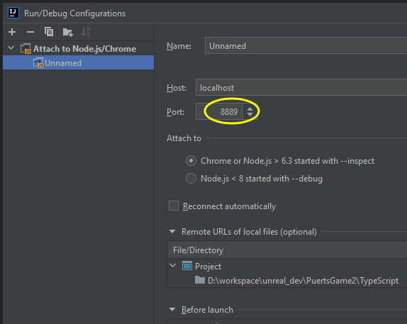

# Summary

[PuerTS](https://github.com/Tencent/puerts) is a high performance script system for Unity and Unreal that founded by [chexiongsheng](https://github.com/chexiongsheng).

This repository is the personal study note referenced to author's tutorial, since there're some issues don't mention in origin documents.

Official tutorial:
跟我用TypeScript做一个FPS游戏  
https://zhuanlan.zhihu.com/p/346531865

Showcase  

***

# Setup

+ Install Unreal Engine 4.
+ Install nodejs: https://nodejs.org/en/download/
+ Clone puerts from https://github.com/Tencent/puerts
+ Copy directory `puerts/unreal/Puerts/` into this project:`PuertsGame/Plugins/Puerts/`.
+ Open cmd and address to directory `PuertsGame/Plugins/Puerts/`, execute command: `node enable_puerts_module.js`.
+ Bulid from visual studio, and start editor, then click plugin button `ud.d.ts`:  

+ If can't find `TS_BaseGun`, `TS_Player` and `TS_Rifle` in directory `PuertsGame/Blueprints/TypeScript/`, which were generated by `PuerTS`, in editor content browser.  
  
You need to edit these TypeScript source file to fire hot swapping of `PuerTS` by adding a blank line is each source file.  
  
If add a blank line and save file, log would output that TypeScript source has been re-compiled:  
  
Then `PuerTS` would auto compile this TypeScript source and auto generate Unreal `.uasset` file under directory `PuertsGame/Blueprints/TypeScript/`.  
+ Set `GameMode` and `Default Pawn Class` in World Settings panel:  
  

***

# Debug in IntelliJ IDEA

+ UE4Editor -> Edit -> Project Settings -> Plugins -> Puerts Settings -> Enable `Debug Mode`, and set `Debug Port` as an unused occupied port.  

+ IntelliJ IDEA -> Run -> Edit Configurations  

+ Add New Configuration -> Attach to Node.js / Chrome  

+ Set `Port` as the same as UE4Editor settings (`8080`)  

+ Re-startup UE4Editor at first time.
+ Debug TypeScript in IntelliJ IDEA:  

+ Play game in UE4Editor.
+ Then breakpoints in IntelliJ IDEA would be hit, and you can watch variables values:  

