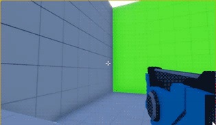

### Summary

`PuerTS` is a high performance script system for Unity and Unreal.  
This's personal study notes reference to official tutorial.

Official tutorial:
跟我用TypeScript做一个FPS游戏  
https://zhuanlan.zhihu.com/p/346531865

Showcase  

### Setup

+ Install Unreal Engine 4.
+ Install nodejs: https://nodejs.org/en/download/
+ Clone puerts from https://github.com/Tencent/puerts
+ Copy directory `puerts/unreal/Puerts/` into this project:`PuertsGame/Plugins/Puerts/`.
+ Open cmd and address to directory `PuertsGame/Plugins/Puerts/`, execute command: `node enable_puerts_module.js`.
+ Bulid from visual studio, and start editor, then click plugin button `ud.d.ts`:  

+ If can't find `TS_BaseGun`, `TS_Player` and `TS_Rifle` in directory `PuertsGame/Blueprints/TypeScript/`, which were generated by `PuerTS`, in editor content browser.  
  
You need to edit these TypeScript source file to fire hot swapping of `PuerTS` by adding a blank line is each source file.  
  
If add a blank line and save file, log would output that TypeScript source has been re-compiled:  
  
Then `PuerTS` would auto compile this TypeScript source and auto generate Unreal `.uasset` file under directory `PuertsGame/Blueprints/TypeScript/`.  

